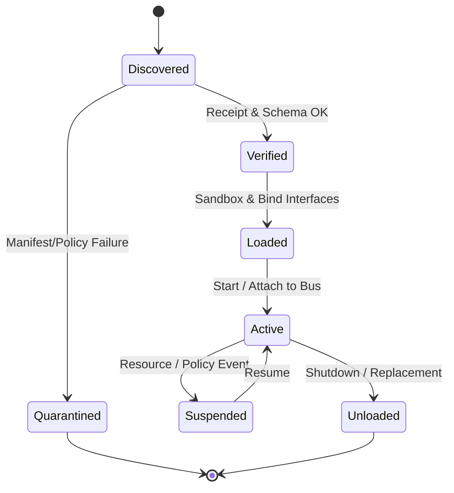

# VNES Runtime Architecture (Enhanced)

## 1. Kernel Responsibilities and Boot Sequence

The **VNES Kernel** is the minimal, trusted core of HyperSync. Its primary responsibilities are:

1. **Bootstrapping core capsules**
   - Load manifests for geometry, consensus, routing, and observability capsules.
   - Verify their receipts and establish trust roots.

2. **Registry integration**
   - Connect to one or more capsule registries (local, tenant, global).
   - Synchronize manifest indexes and vector embeddings.

3. **Discovery & provisioning**
   - Scan local `capsules/` directories.
   - Resolve dependencies for requested capsules.
   - Apply governance filters (tier, determinism, trust zone).

4. **Verification & admission control**
   - Validate manifests against the manifest schema.
   - Check receipts against on-disk contents.
   - Refuse to load or quarantine mismatched capsules.

5. **Lifecycle & orchestration**
   - Manage capsule states: `discovered → verified → loaded → active → suspended → unloaded`.
   - Handle hot-reload, hot-swap, and rollback.

---

## 2. Capsule Lifecycle and State Machine

### 2.1 Admission & Quarantine

During admission, the kernel:

- Validates `manifest.json` against the VNES manifest schema.
- Validates `receipt.stunir.json` against the VNES receipt schema.
- Recomputes hashes for `spec/`, `manifest.json`, and `impl/`.
- Evaluates governance and trust metadata.

Failures result in a **Quarantined** state, where:

- The capsule cannot be activated.
- Diagnostics are emitted to the observability plane.
- Optional remediation workflows may be triggered (e.g., re-build, re-sign).

### 2.2 Loading, Sandboxing, and Binding

The kernel loads capsules into sandboxes based on manifest metadata:

- **Python capsules** – Isolated interpreters or module namespaces.
- **WASM capsules** – Loaded into a WebAssembly runtime.
- **Native capsules** – Executed via well-defined FFI boundaries.

Binding occurs via declarative interfaces in the manifest:

- Entry points (e.g., `python`: `impl.src.main:run`).
- Supported protocols (RPC, event-driven, stream processing).
- Declared input/output schemas.

### 2.3 Dependency Injection

Capsules declare dependencies in their manifests (`capabilities.requires`). The kernel:

- Resolves required capabilities to concrete capsule instances.
- Ensures determinism and governance constraints are satisfied.
- Injects references into the capsule's sandbox during initialization.

Hot-swaps (e.g., changing geometry models) are mediated by the kernel, which:

- Spins up the new capsule instance.
- Migrates or rebinds dependents according to policy.
- Drains and retires the old instance.

---

## 3. Isolation Domains and Trust Zones

To support mixed-trust workloads, the runtime defines **isolation domains**:

- **System domain** – Core capsules critical to platform integrity.
- **Tenant domain** – Tenant-owned capsules (e.g., custom strategies).
- **Session domain** – Short-lived, user- or AI-specific capsules.
- **Ephemeral domain** – Experimental or speculative capsules.

Manifests declare a `trust_zone`, which the kernel maps to:

- Sandbox strength (e.g., language-level sandbox vs. process-level vs. VM-level).
- Accessible resources (filesystem, network, devices).
- Scheduling priorities and co-location constraints.

High-trust capsules (e.g., `hypersync.core.*`) are few and tightly reviewed. Most capsules live in tenant, session, or ephemeral zones.

---

## 4. Scheduling and Placement

The runtime includes a **Capsule Scheduler** responsible for mapping capsule instances to executors:

- **Inputs to scheduling**:
  - Capsule metadata: determinism tier, resource requirements, latency class.
  - Environment metadata: node capabilities (CPU/GPU, memory, network).
  - Policy metadata: multi-tenant isolation, fairness, priorities.

- **Placement strategies**:
  - Co-locating data-heavy capsules with their primary state shards.
  - Spreading redundant capsules across failure domains.
  - Enforcing tenant isolation boundaries.

- **Execution models**:
  - Event-driven (reactive to bus topics).
  - Pull-based (polling or scheduled jobs).
  - Request/response (synchronous RPC).

Scheduling decisions and movements can be recorded in receipts or auxiliary logs for replay and forensic analysis.

---

## 5. Event Bus – The Nervous System

The **VNES Event Bus** is the primary coordination fabric between capsules.

### 5.1 Topics and Schemas

- Topics are namespaced and versioned (e.g., `telemetry.metrics.v1`, `consensus.vote.v2`).
- Each topic is bound to one or more JSON Schemas.
- The bus validates published events against the schemas for critical topics.

### 5.2 Ordering and Delivery

- For deterministic capsules (e.g., `D0_bit_exact`, `D1_numerically_stable`), the bus enforces:
  - **Per-topic total ordering** for a given partition.
  - Replayable logs for time-travel and debugging.

- QoS levels can range from "at most once" to "exactly once" where required.

### 5.3 Backpressure and Flow Control

- Subscribers can advertise consumption rates and buffer limits.
- The bus can apply backpressure, shedding, or aggregation strategies driven by policy capsules.

---

## 6. Data Plane – Shared State and Snapshots

The **VNES State Store** provides transactional, shared state for capsules:

- **Key ownership** – Each key has an owning capsule or capsule type.
- **Transactional writes** – Multi-key writes commit atomically.
- **Versioning** – Every write produces a new version with a logical timestamp.

This enables:

- **Time-travel debugging** – Inspect state as of a given event or frame.
- **Branching experiments** – Fork state into sandboxes for "what-if" analysis.
- **Deterministic replay** – Reconstruct trajectories using events + state snapshots.

---

## 7. Vector Indexes and Capsule Caching

To serve AI and human queries with low latency, the runtime maintains:

- **Vector indexes** of capsule embeddings (semantic and capability vectors).
- **Local caches** of frequently used capsules and their decoded manifests.

Caches are keyed by:

- Capsule ID + version.
- Manifest/receipt hash.

Invalidation occurs when:

- A capsule is superseded by a newer version.
- Governance or trust metadata changes.
- Policy capsules dictate cache eviction.

---

## 8. Observability, Telemetry, and Receipts

The runtime is instrumented to produce:

- **Execution traces** – Which capsules executed, with what inputs and outputs.
- **Performance metrics** – Latency, resource usage, error rates per capsule.
- **Security / policy logs** – Admission, quarantine, and sandboxing decisions.

Critical operations may emit structured **VNES Receipts**, conforming to the receipt schema. These bind together:

- Capsule identity and determinism tier.
- Input and output hashes.
- Toolchain and environment metadata.
- Signatures from build and deployment authorities.

Taken together, the runtime architecture provides a **deterministic, auditable substrate** on which HyperSync can safely compose complex behavior across geometry, consensus, UI, and user-defined logic.
