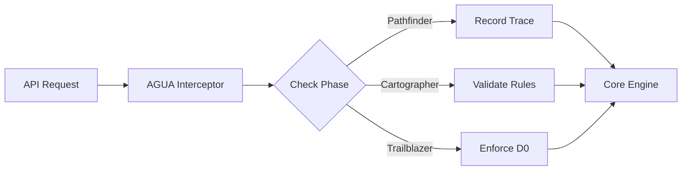

# Automated Geometric Universal Architecture (AGUA)

## Overview
AGUA is the **Determinism Engine** and **Execution Supervisor** for HyperSync. It is responsible for enforcing the strict determinism guarantees required by the system's geometric protocols. AGUA acts as a middleware layer, intercepting every request to ensure it complies with the active **Determinism Tier (D0-D2)** and **PCT Phase** (Pathfinder, Cartographer, Trailblazer).

Unlike a passive library, AGUA actively governs *how* code is executed, ensuring that "same inputs always produce same outputs" according to the required strictness level.

## Core Responsibilities

### 1. Determinism Enforcement (D0-D2)
AGUA categorizes and enforces execution constraints based on three tiers:

*   **D0 (Fully Deterministic)**: Bit-exact reproducibility. Required for financial, cryptographic, and legal operations.
    *   *Constraints*: No random seeds, sequential execution only, strict IEEE 754 floating point.
*   **D1 (Statistically Deterministic)**: Results within epsilon tolerance. Used for scientific computing and ML training.
    *   *Constraints*: Fixed random seeds, deterministic reduction, relaxed floating point.
*   **D2 (Non-Deterministic)**: Best-effort, exploratory. Used for visualization and analytics.
    *   *Constraints*: Unrestricted parallelism, fast math allowed.

### 2. PCT Phase Supervision
AGUA modulates system behavior based on the agent's current **PCT (Perceptual Control Theory)** phase:

*   **Pathfinder**: Exploration phase. AGUA records traces and allows broader D1/D2 operations.
*   **Cartographer**: Mapping phase. AGUA enforces stricter boundaries to stabilize the "map".
*   **Trailblazer**: Execution phase. AGUA enforces strict D0/D1 compliance to ensure reliable repetition.

### 3. Request Interception
The `AguaInterceptor` sits between the API and the Core Engine:

## Operational Modes

AGUA defines the operational envelope for the system:

*   **Conservative Geometric Core**: Restricts operations to D0 and limited D1.
*   **Exploration & Research**: Opens up D2 for experimental workloads.
*   **Human-Facing**: Optimizes for explainability (D1_visual).

## Integration

*   **Spec**: Defined in `03_specifications/geometry/agua/agua_geometry_spec.json`
*   **Logic**: Detailed in `02_program/internals/agua/agua_interceptor_logic.md`
*   **Tiers**: Defined in `03_specifications/core/determinism_tiers.json`
